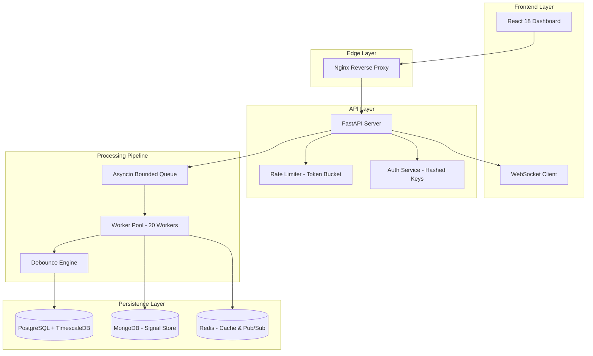

# 🛡️ Incident Management System (IMS)

[](https://fastapi.tiangolo.com/)
[](https://reactjs.org/)
[](https://www.postgresql.org/)
[](https://redis.io/)

A high-performance, production-ready Incident Management System designed to handle high-frequency signal ingestion, real-time debouncing, and automated alerting. Built with a focus on reliability, scalability, and SRE best practices.

---

## 🏗️ System Architecture

The system is built using a modern distributed architecture designed to handle bursts of up to 10,000 signals/sec with graceful backpressure handling.



---

## ✨ Key Features

### 🚀 High-Performance Processing
- **Signal Debouncing**: Redis-based sliding window deduplication prevents alert fatigue by grouping related signals into single actionable incidents.
- **Batch Processing**: Background workers utilize batching (up to 500 items) to optimize database I/O.
- **Async Operations**: Fully non-blocking I/O using `FastAPI`, `asyncpg`, and `Motor`.

### 🛡️ Resilience & Security (SRE Focused)
- **Backpressure Handling**: Bounded queues with HTTP 429 feedback prevent memory exhaustion during spikes.
- **Database Pooling**: Robust connection pooling (`AsyncAdaptedQueuePool`) minimizes handshake overhead.
- **Secure Auth**: Database-backed API key validation using SHA-256 hashing and Redis-based session caching (TTL: 5m).
- **Circuit Breakers & Retries**: Exponential backoff decorators on all critical database operations.

### 📊 Real-Time Observability
- **Live Dashboard**: Real-time incident updates via Redis Pub/Sub and WebSockets.
- **Health Monitoring**: Deep health checks verifying connectivity to all backing services.
- **Structured Logging**: Context-aware JSON logging for seamless ELK/Splunk integration.
- **MTTR Metrics**: Automated calculation of Mean Time To Recovery for all resolved incidents.

---

## 🚦 Quick Start

### Prerequisites
- Docker & Docker Compose
- Python 3.11+ (for local development)

### Deployment
```bash
# Clone the repository
git clone <repo-url>
cd incident-management-system

# Start the entire stack
docker compose up --build -d
```

| Service | URL |
| :--- | :--- |
| **Frontend** | [http://localhost:3000](http://localhost:3000) |
| **API Backend** | [http://localhost:8000](http://localhost:8000) |
| **API Documentation** | [http://localhost:8000/docs](http://localhost:8000/docs) |
| **System Health** | [http://localhost:8000/health](http://localhost:8000/health) |

---

## 🛠️ Configuration

Environment variables can be tuned in the `docker-compose.yml` or a `.env` file:

- `DATABASE_URL`: PostgreSQL connection string.
- `MONGO_URI`: MongoDB connection string.
- `REDIS_URL`: Redis connection string.
- `QUEUE_MAX_SIZE`: Max signals allowed in memory (Default: 50,000).
- `WORKER_COUNT`: Number of concurrent processing workers (Default: 20).

---

## 🧪 Testing & Validation

The project includes a comprehensive test suite covering the core domain logic and resilience patterns.

```bash
# Run backend tests
cd backend
pytest tests/ -v
```

**Simulate a production failure:**
```bash
# Generates a burst of signals to verify debouncing and scaling
python scripts/mock_failure.py
```

---

## 📜 API Reference (V1)

### 🚨 Signals
- `POST /api/v1/signals` - Ingest raw telemetry (Single/Bulk).
- `GET /api/v1/signals/{id}` - Retrieve source signals for an incident.

### 📋 Incidents
- `GET /api/v1/incidents` - List active incidents (paginated, sorted by P0->P3).
- `PATCH /api/v1/incidents/{id}/status` - State machine controlled transitions.
- `POST /api/v1/incidents/{id}/rca` - Submit Root Cause Analysis.

---

## ⚖️ License
Distributed under the MIT License. See `LICENSE` for more information.
